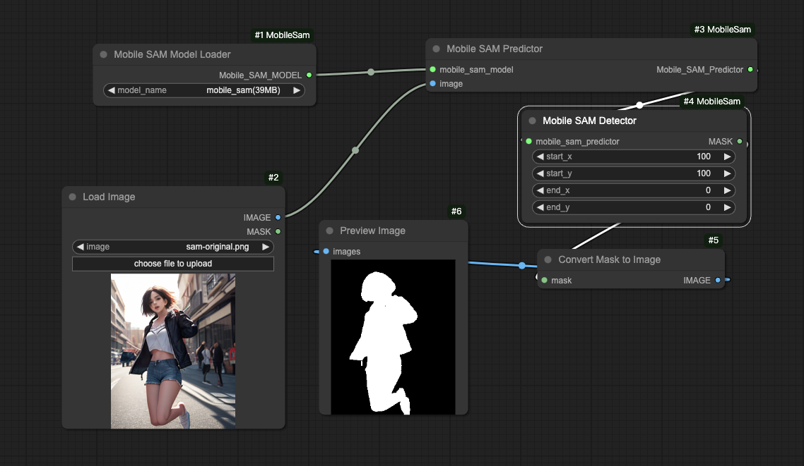

# ComfyUI-MobileSam
基于 [MobileSam](https://github.com/ChaoningZhang/MobileSAM) 的 ComfyUI 自定义节点，目前仅支持手动输入坐标信息，不支持图片交互式获取坐标。


## 安装

Clone 仓库到 ComfyUI/custom_nodes

```bash
cd Your-ComfyUI/custom_nodes
git clone git@bitbucket.org:globalsphere/comfyui-mobilesam.git
```

安装依赖

```bash
cd Your-ComfyUI/custom_nodes/comfyui-mobilesam
pip install -r requirements.txt
```

## 使用
在 ComfyUI 中加载 workflows 文件夹中的工作流，Mobile SAM Detector 节点中的 start_x、start_y 表示矩形框左上坐标的 x、y 值，end_x、end_y 表示矩形框右下坐标的 x、y 值，如果 end_x、end_y 均为 0，则表示使用点选模式（以 start_x、start_y 坐标点选）。